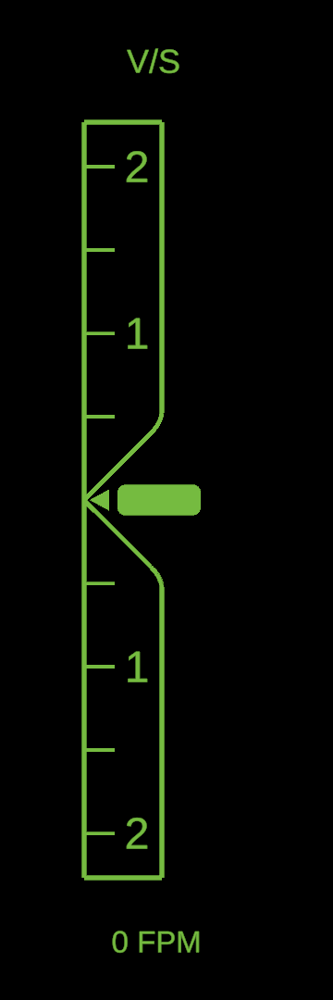
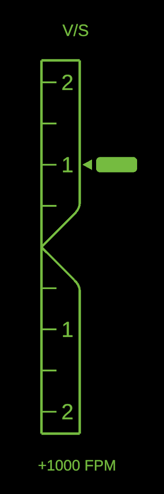
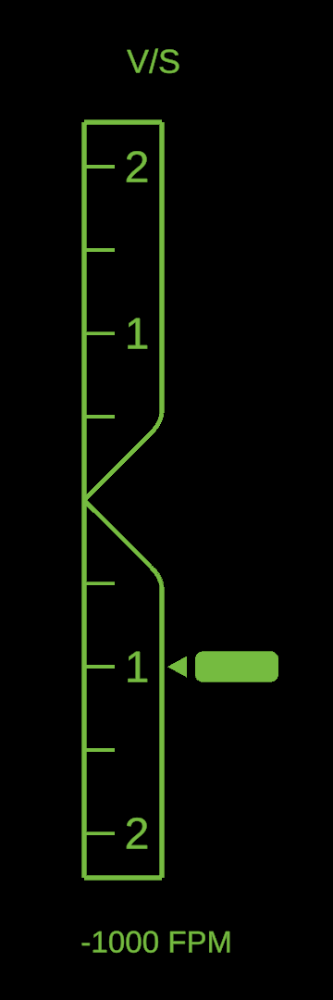
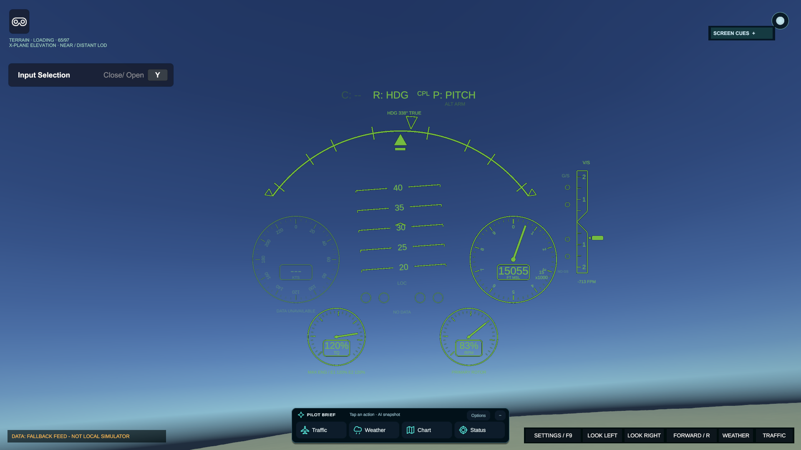
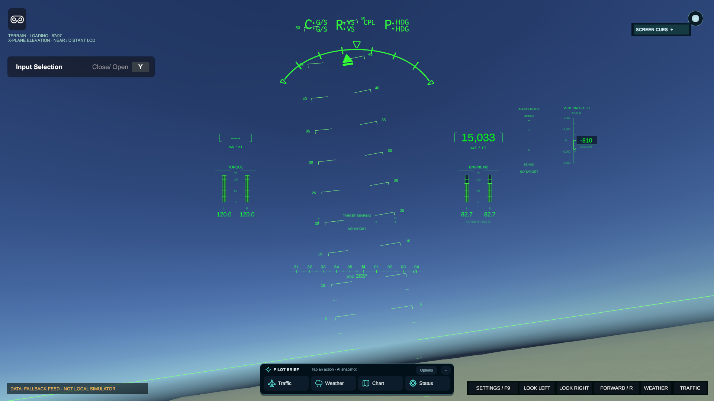
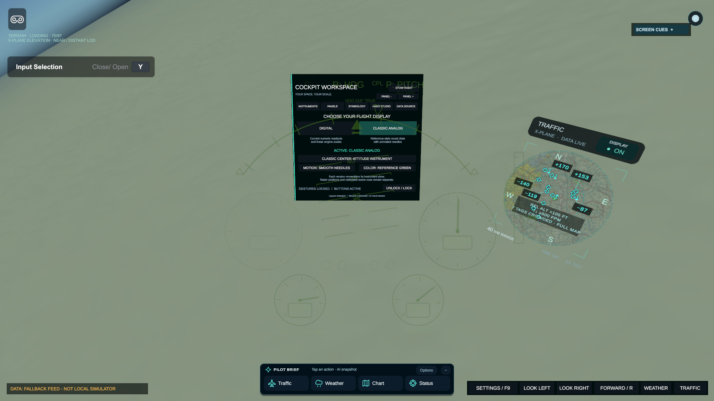
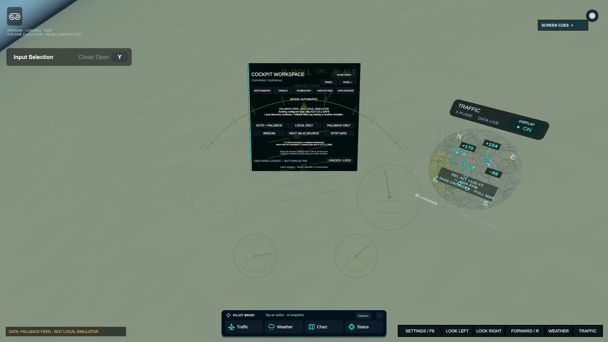
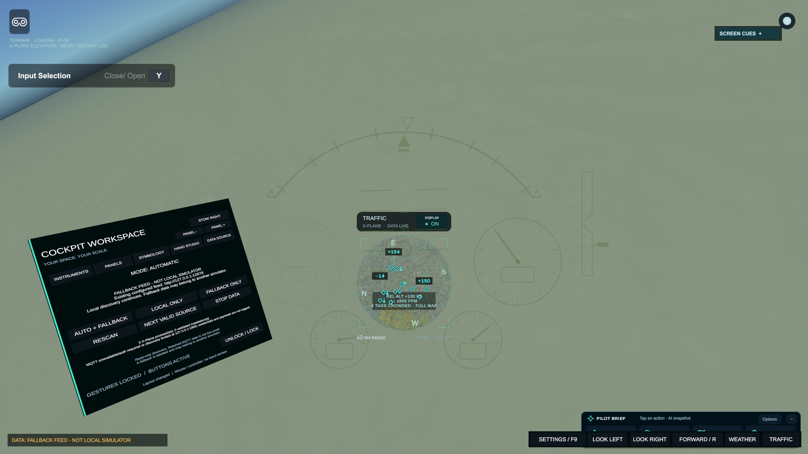
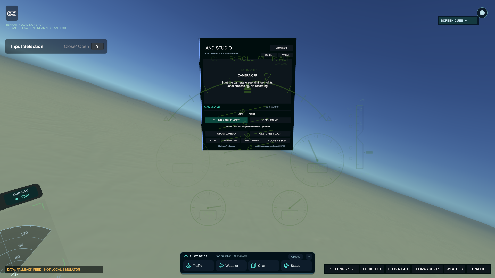

# FAA Symbology Unity Project

The FAA Symbology Unity Project is a Unity 6.5 cockpit-display demonstrator for
FAA-style flight symbology, real-time traffic and weather awareness, sectional
chart context, and headset output. It is the integration workspace for the
OPL/FAA display work: the same flight state can drive the desktop HUD, the
traffic and weather radars, X-Plane-derived terrain (with optional Cesium hooks), and either a Varjo
XR-3 workflow or the SA-147 multi-display output path.

> **Project status:** active integration/prototyping software. This repository is
> not a certified flight instrument, navigation database, collision-avoidance
> system, or source of operational flight data. Network feeds can be delayed,
> incomplete, unavailable, or wrong. Always cross-check against approved
> aeronautical sources, aircraft procedures, and ATC before making a flight
> decision.

## Documentation and source

This landing page documents the current integration branch and released XR-3 player.
The default branch retains its older application history; use the linked current source
for these features.

[Complete project reference and setup](https://github.com/CatfishW/FAA/blob/codex/pilot-hud-telemetry-release/README.md) · [Windows releases](https://github.com/CatfishW/FAA-Unity-S76D/releases)

## Current pilot-system update

### September 25, 2026 — reference VSI, automatic sources and cockpit workspace

**Windows XR-3 package:** [reference VSI + automatic discovery](https://github.com/CatfishW/FAA-Unity-S76D/releases/tag/xr3-20260925-vsi-autodiscovery).
The non-Development x64 build succeeded with **0 errors and 513 warnings**; native
headset/Windows runtime testing remains pending. Source: `90915f02`; release source:
`d746be0d`. The ZIP and release verification report are the authority for that package.

This section describes the current implementation on
[`codex/pilot-hud-telemetry-release`](https://github.com/CatfishW/FAA/tree/codex/pilot-hud-telemetry-release).
Windows XR-3 packages and exact source/build evidence are published in the
[FAA-Unity-S76D releases](https://github.com/CatfishW/FAA-Unity-S76D/releases).
The repository landing page is a documentation entry point: use the implementation
branch or the source revision named by a release, rather than assuming an older
default branch or an older ZIP contains every update shown here.

**Research boundary:** the screenshots below are actual Unity renders, not generated
concept art. The main flight views use available live simulator telemetry; the VSI
close-ups use explicitly labelled test values. No webcam images, private keys,
credentials or installed X-Plane scenery files are included in this documentation.
Physical XR-3 optics, tracking accuracy and sustained Windows headset performance
remain separate hardware-validation work.

| Recent change | What now happens |
|---|---|
| Reference vertical-speed bar | Internal `1`/`2` numerals, a tapered zero notch with rounded shoulders, and a detached rounded pointer that never covers the numbers. |
| Automatic simulator discovery | Local process/install and port inspection; native X-Plane Web API and UDP; semantic discovery of actual MQTT topics; explicit source identity and fallback status. |
| Switchable flight instruments | Digital and Classic Analog presentations share the same live data and retain separate instrument-size preferences. |
| Protected cockpit workspace | Weather, Traffic, Settings and Hand Studio are independent 3D panels beside the pilot, not large forward-overlay columns. |
| Mouse and XR interaction | Right-click dragging works while gestures are locked; tracked-hand grips and two-hand resizing use explicit gesture mode. |
| Laptop-camera hand control | All 21 hand landmarks, thumb-to-any-finger pinches, an open-palms alternative, continuous display-frame resizing, and opt-in local processing. |
| Stable presentation | Non-conformal layout uses canvas-local geometry; Pilot Brief has a fixed collapsed anchor; side-panel inspection does not change flight-canvas projection. |
| X-Plane terrain | Georeferenced installed DSF elevation, independently configured terrain connectivity, explicit coverage/error states and a reconnecting development tunnel. |
| Windows XR-3 delivery | Native Varjo/Ultraleap libraries, non-Development x64 builds, exact source provenance, file inventory and SHA-256 checksums. |

### Reference-style vertical-speed indicator

The Classic Analog VSI now follows the requested narrow silhouette. A straight left
rail and curved right shoulders converge at the zero-rate notch. Major numerals sit
**inside the outline**, between the tick ends and the right rail, with verified
clearance at 40%, 72%, 100% and 160% instrument size. The moving marker consists of a
left-facing triangular arrowhead and a separate filled rounded rectangle.

  
  
  

**Inspection fixtures, left to right: 0, +1,000 and −1,000 FPM.** These are rendered
by the production Unity mesh/text components with isolated test input, not measured
flights. The black background is confined to these close-up fixtures; the in-game
HUD remains transparent.

The range remains ±2,000 FPM, with 500-FPM intermediate marks and a signed numeric
readout. Beyond the range, only pointer position is clamped; `OFF SCALE` and the
actual rate remain visible. Invalid/stale data removes the live pointer instead of
showing a falsely centred zero. Existing frame-time-based smoothing and reduced-motion
controls are retained. [Geometry, mappings and tests](docs/REFERENCE_VSI.md).

### Digital and Classic Analog versions

Open **SETTINGS / F9 → LOOK RIGHT → SYMBOLOGY** on a laptop, or look naturally toward
the side Settings panel in XR. Select **DIGITAL** or **CLASSIC ANALOG**. Buttons work
while gestures remain locked. Each version remembers its own sizes; switching ends
an active resize gesture rather than applying its old baseline to a different style.

*Classic Analog in the actual Game view. Needle positions and readout values come
from the selected live feed, whose provenance is shown by the source badge.*

*Digital uses the same source and cockpit workspace. Version switching is presentation,
not a simulator connection change.*

Classic provides circular IAS, altitude, torque and rotor-RPM instruments, a bank arc,
course/glideslope indications, and the new VSI. The screenshot used as a design
reference is not a calibration specification: the implementation explicitly labels
units and mappings. Altitude is a 1,000-foot needle revolution with a full MSL numeric
readout and a separate thousands indication. Torque is the maximum of the expected
available engines, not a fabricated reading from a missing engine. Collective-mode
telemetry is not inferred from pitch mode; `C: --` remains unavailable when the source
does not establish it.

The Classic centre can show a **non-conformal attitude instrument** or the existing
**conformal scene cues**. The two are deliberately distinct. Resizing a head-fixed
airspeed dial must not alter the optical/angular placement of an FPV, horizon or
geographic marker. Camera FOV, IPD and native lens distortion are not size controls.
Read [switchable symbology](docs/SWITCHABLE_SYMBOLOGY.md) and
[conformal rotorcraft cues](docs/ROTORCRAFT_CONFORMAL_HUD.md) for the signal boundaries.

*The actual in-game SYMBOLOGY page during deliberate side inspection. Version selection,
needle-motion preferences and palette choices remain separate from radar positioning.*

### Automatic local X-Plane and topic discovery

A downloaded player now looks for usable local simulator data before attempting the
existing fallback feed. It checks process/install metadata, known local ports and,
on Windows, owner-PID port tables for X-Plane and supported broker processes. It
resolves native Web API dataref IDs for the current simulator session, or subscribes
to native UDP RREF datarefs. It can also listen to already-configured UDP DATA output
and observe authorized MQTT topics.

*Actual source diagnostics on the development machine. A fallback is labelled as
non-local; a connected broker alone is not proof that the simulator is on this PC.*

A candidate must provide a complete, plausible flight core over multiple fresh samples.
Selection is sticky to avoid repeated switching. Fields from different source IDs or
MQTT publisher prefixes are never combined. Native session restart discards dataref IDs
and old values. A failed connection does not turn missing data into valid zeros.

For MQTT, the program discovers **actual topics carrying recognized telemetry** rather
than guessing topic names. It accepts canonical `sim/...` dataref maps, explicitly
unit-labelled `ownship` snapshots, and scalar canonical-dataref topics under one coherent
publisher prefix. The default local broker discovery window is bounded; it narrows to
recognized filters afterward. Retained messages do not qualify as live source evidence.
Arbitrary unitless/custom formats are not silently guessed, and authentication is not
bypassed. Configure non-default remote broker locations or credentials through the
provided source configuration.

**DATA SOURCE** offers **AUTO + FALLBACK**, **LOCAL ONLY**, **FALLBACK ONLY**, **RESCAN**,
**NEXT VALID SOURCE**, and **STOP DATA**. A manual pin does not silently select another
aircraft when the pinned source disappears. `DataSources.json` configures explicit
endpoints, broker filters, environment-variable credential references, timing and
terrain routing. Detailed schema, limits and protocol notes are in
[automatic X-Plane sources](docs/AUTOMATIC_XPLANE_SOURCES.md).

**Fallback reachability matters.** The existing `127.0.0.1:12678` feed is a local SSH
forward on the developer's machine, not a public service available on every downloaded
PC. The player automatically attempts its configured fallback when local discovery
fails, but the user still needs an authorized reachable endpoint or their own tunnel.
`Start-Fallback-Tunnel.cmd` uses the operator's existing SSH alias and contains no keys
or passwords. If neither local nor fallback data is reachable, the HUD states that
there is no data. It never claims an imaginary connection.

### Side panels and stable interaction

Weather and Traffic default to about 95° left/right, below eye level, 1.7 metres from
the seated reference. Settings and Hand Studio default to ±90°, slightly below eye
level, 1.5 metres away. Protection uses the **complete panel group**, including drawers,
headers and weather cards, so opening a menu cannot suddenly block the forward cone.
Large/near panels may be constrained farther to the side; the constraint does not
change instrument calibration.

*The pilot deliberately looks toward Traffic here. Returning forward leaves the radar
in cockpit-side space instead of attaching it to the main HUD.*

| Action | Laptop/desktop | Native XR-3 |
|---|---|---|
| Open Settings | SETTINGS / F9 | Select Settings, then look toward its side position. |
| Inspect a side panel | LOOK LEFT, LOOK RIGHT, WEATHER or TRAFFIC | Turn the head naturally; desktop buttons do not drive tracked pose. |
| Return forward | FORWARD / R | Tracked head pose remains authoritative. |
| Move a panel | Right-click and drag, even while gestures are locked. A press starting outside panels remains camera look-around. | Enable gestures, point at the labelled top grip, pinch and move. |
| Resize | Per-instrument slider/buttons, group buttons or utility PANEL −/+. | The same controls, or two tracked hand grips. |
| Finish | Release the mouse; lock gestures when finished. | Release; tracking/focus loss cancels ownership and requires a fresh gesture. |

Manual size buttons work while gestures are locked. Left-click still operates radar
settings, map actions and buttons. Side-panel opening no longer switches the flight HUD
between camera-space and overlay modes. Instrument geometry is computed in stable
canvas-local coordinates, and the collapsed Pilot Brief has a fixed bottom-centre anchor.
See [right-click/XR dragging](docs/RADAR_BRIEF_RIGHT_DRAG.md) and
[peripheral stability](docs/PERIPHERAL_HUD_STABILITY.md).

### Laptop hand gestures and camera privacy

*Hand Studio is another side-mounted 3D panel. Opening it does not open the camera.
This documentation capture contains no camera image.*

The local recognizer provides 21 landmarks per hand, finger-extension measurements and
thumb-to-index/middle/ring/little-finger distances. Choose **THUMB + ANY FINGER** or
**OPEN PALMS**. Hold the deliberate gesture, then separate/bring together the hands to
enlarge/shrink the active non-conformal HUD. The renderer interpolates on every display
frame; recognition results do not directly step the HUD at their lower arrival rate.

Configured limits are a maximum 480-pixel inference edge and up to 24 recognition samples
per second, with one frame in flight. These are not promises of actual laptop throughput.
Brief occlusion freezes sizing and safe reacquisition rebases it; prolonged loss, release,
focus loss, stopping the camera or style switching ends the gesture. Camera gestures
never move radar panels or change conformal calibration.

Camera capture is opt-in, has a visible preview, and stops on close/focus loss. macOS has
explicit **ALLOW CAMERA** and permission-settings actions; OS approval remains the user's
choice. Processing is local through the pinned MediaPipe helper with anonymous pipes,
not a cloud API. No image recording, upload or microphone capture is performed by this
feature. The Mac arm64 helper is validated locally; a Windows player needs a matching
Windows helper for this optional laptop-camera mode. Native XR-3 Ultraleap tracking is a
separate path. [Hand Studio](docs/MULTIFINGER_SPATIAL_STUDIO.md) ·
[permissions and packaging](docs/LAPTOP_CAMERA_GESTURES.md).

### Terrain, releases and validation boundaries

Terrain uses the installed X-Plane DSF elevation raster with synthetic shading. It is
not a copy of final textured scenery and is not suitable as an operational terrain-clearance
system. Flight telemetry and terrain connectivity are separate. Automatic source changes
clear prior state and route terrain independently to avoid retaining another simulator's
world. A local DSF service must actually exist; detecting X-Plane does not install or
reproduce its scenery automatically. [Terrain setup](Tools/XPlaneTerrain/README.md).

For Windows, extract the **entire** XR-3 ZIP, start Varjo Base, then run `Launch-XR3.cmd`.
Keep the executable, data folder, UnityPlayer.dll, MonoBleedingEdge and native plugins
together. Use the packaged terrain/source guides and diagnostic scripts. No secrets or
installed simulator scenery are packaged. A non-Development build may still be marked
**prerelease** on GitHub while physical hardware validation is pending.

Validation distinguishes deterministic geometry/protocol checks, actual Unity runtime
and input-module tests, isolated real socket tests, and actual live source observations.
The protocol fixtures exercise real C# clients but never feed synthetic test aircraft into
the live bridge. Still-photo hand inference is not evidence of live camera accuracy.
Each release publishes its exact source commits/tree, build errors/warnings, inventory and
checksum. Read that release's report instead of treating older counts as current.

The September 25 source validation for this revision recorded **555 focused Unity
assertions passed**: 448 Editor cases, 14 source-integration checks, 13 VSI runtime
checks, 29 analog checks, 24 radar/Brief checks and 27 conformal checks. These are
direct fixture runs, not a full-project certification or hardware test. Real local
protocol fixtures verified all three clients, MQTT wildcard narrowing and cancellation,
and removal of 41 indexed UDP subscriptions. The actual mouse input module switched
both symbology versions, and the 300-frame probe recorded zero geometry movement in
its 200 settled samples. The available real fallback feed remained healthy and terrain
had 97/97 tiles with ownship coverage during the observed development check.

New reproducible checks include `RunReferenceVsiAssertions.cs`, `RunReferenceVsiRuntime.cs`,
`RunSourceDiscoveryRuntime.cs`, and `verify_source_discovery_wires.py` under
`Tools/ExplanationVerification/`. Existing analog switching, radar/Brief, conformal and
render-frame probes are also retained. Documentation screenshots are curated regular Git
blobs under `docs/screenshots/`; temporary QA captures and recovery files remain ignored.

For the older telemetry/chart architecture and deployment history, retain the
[Pilot HUD and telemetry release — 2026-09-10](docs/PILOT_HUD_TELEMETRY_RELEASE_2026-09-10.md).
The sections below provide the wider project reference; the current modular symbology,
side-panel and automatic-source descriptions above supersede earlier fixed-overlay or
single-feed assumptions.

